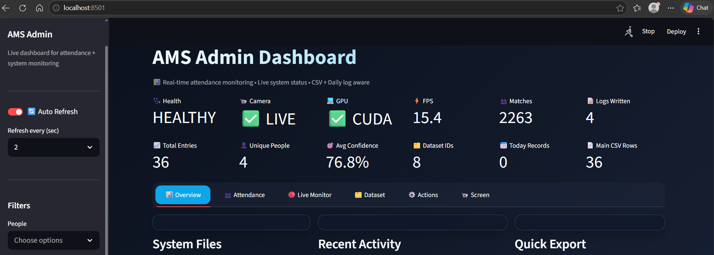

# Face Recognition Attendance Management System

A real-time face recognition attendance management system built with Python, OpenCV, Streamlit, and InsightFace `buffalo_l`, with optional Google Sheets integration.

## Overview

This project automates attendance tracking using a live camera stream and real-time face recognition. It includes a Streamlit-based admin dashboard for monitoring attendance logs, managing identity datasets, reviewing runtime status, exporting CSV records, and controlling the recognition workflow.

The recognition pipeline uses InsightFace `buffalo_l`, a high-performance face analysis model pack from the InsightFace ecosystem for face detection, landmark estimation, attribute prediction, and embedding-based identity matching. The broader InsightFace project describes its methods as state-of-the-art face analysis techniques.

## Features

- Real-time face recognition from a live camera stream
- Attendance logging to CSV files
- Streamlit admin dashboard for analytics and system monitoring
- Identity dataset management with upload, preview, rename, and delete actions
- Face capture utility for collecting aligned face images
- Face encoding pipeline using InsightFace embeddings
- Optional Google Sheets integration
- Runtime controls for starting, stopping, and monitoring the recognition system

## Tech Stack

- Python
- OpenCV
- InsightFace
- ONNX Runtime GPU
- Streamlit
- Plotly
- Pandas
- scikit-learn
- Google Sheets API

## Project Structure

```text
face-recognition-attendance-management-system/
├── ams.py
├── system.py
├── admin_ui.py
├── encode_faces.py
├── capture_photos.py
├── utils.py
├── requirements.txt
├── .gitignore
└── README.md
```

## Installation

1. Clone the repository:

   ```bash
   git clone https://github.com/JwelSharma/face-recognition-attendance-management-system.git
   cd face-recognition-attendance-management-system
   ```

2. Create a virtual environment:

   ```bash
   python -m venv venv
   ```

3. Activate the environment:

   On Windows:
   ```bash
   venv\Scripts\activate
   ```

   On macOS/Linux:
   ```bash
   source venv/bin/activate
   ```

4. Install dependencies:

   ```bash
   pip install -r requirements.txt
   ```

## Setup

Before running the project, prepare the following locally:

- A `dataset/` folder with one subfolder per person
- A valid camera stream URL
- `credentials.json` if Google Sheets synchronization is enabled
- A CUDA-compatible environment for GPU acceleration, if available

These local/private files are intentionally not included in the public repository.

## Usage

### Run the admin dashboard

```bash
streamlit run admin_ui.py
```

### Run the attendance system

```bash
python system.py
```

### Build face encodings

```bash
python encode_faces.py
```

### Capture photos for a new identity

```bash
python capture_photos.py
```

Or pass a person name directly:

```bash
python capture_photos.py John_Doe
```

## Model Information

This project uses the InsightFace `buffalo_l` model pack for face analysis and embedding generation. According to the InsightFace package documentation, `buffalo_l` includes detection, recognition, alignment, attributes, and related face analysis outputs.

## Repository Notes

This public repository does not include:

- dataset images
- attendance logs
- generated encodings
- private settings
- credentials
- local network camera URLs
- private Google Sheets links

Update those values locally before running the system.

## Important Note on Model Licensing

The InsightFace Python library code is released under the MIT License, but the pretrained models provided with the library are documented as available for non-commercial research purposes only unless separately licensed. Review the official InsightFace licensing terms before using pretrained models in commercial deployments.

## Screenshots

### Admin Dashboard


### Multi-Camera Monitoring


### Dataset Creation


## Future Improvements

- Config-based environment setup
- Better deployment workflow
- Improved face quality validation
- Cloud storage or database integration
- Multi-camera support
- Authentication and role-based dashboard access

## License

This repository is shared for educational and portfolio purposes. Review third-party library and model licenses before production or commercial use.
